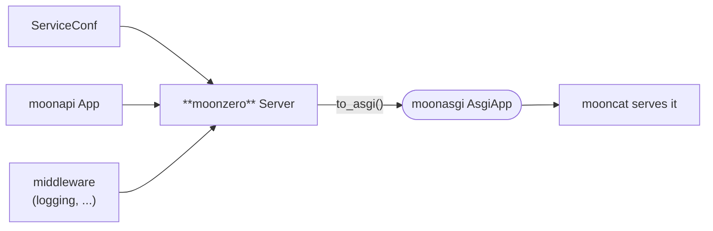

<div align="center">

# moonzero

**A service framework for MoonBit — `← go-zero`.**

[](https://github.com/moonbitstack/moonzero/actions/workflows/ci.yml)
[](./LICENSE)
[](https://mooncakes.io/docs/Lfan-ke/moonzero)

</div>

`moonzero` is the integration layer of the **moon\*** suite — the role `go-zero` plays for Go. It assembles a [`moonapi`](https://github.com/moonbitstack/moonapi) application from config, wraps it in middleware, and produces a runnable [`moonasgi`](https://github.com/moonbitstack/moonasgi) `AsgiApp` that a server (`mooncat`) runs. It depends only on `moonapi` + `moonasgi`, so it stays backend-agnostic.



## Quickstart

```moonbit
let app = @moonapi.App::new()
let api = @moonzero.Group::new(app, "/api/v1")     // prefix a set of routes
api.get("/ping", _ctx => @moonapi.text(200, "pong"))

let conf = @moonzero.ServiceConf::new(
  name="greet", host="127.0.0.1", port=8888, timeout_ms=3000, log_level=Info,
)
let server = @moonzero.Server::new(conf, app)
  .use_(@moonzero.cors(@moonzero.CorsConf::new()))   // Access-Control-* headers
  .use_(@moonzero.request_id())                      // x-request-id per request
  .use_(@moonzero.recovery)                           // 500 instead of a panic
  .use_(@moonzero.logging)

server.describe()        // "greet listening on 127.0.0.1:8888"
@mooncat.serve(server.to_asgi(), host=conf.host, port=conf.port)   // run it (native)
```

Verified across all backends (`wasm`, `wasm-gc`, `js`, `native`) in CI, 0 warnings under `--deny-warn`.

## Resilience middleware

Beyond the base onion (logging, recovery, CORS, request-id), moonzero ships go-zero's resilience set, each modelled as a pure decision core over an injected [`Clock`](./clock.mbt) so its timing is exactly testable:

```moonbit
let clock = @moonzero.Clock::new(() => now_ms())     // real time at the async edge
let server = @moonzero.Server::new(conf, app)
  .use_(@moonzero.maxbytes(1 << 20))                                   // 413 over 1 MiB
  .use_(@moonzero.rate_limit(@moonzero.TokenBucket::new(100.0), clock))// 429 when empty
  .use_(@moonzero.breaker(@moonzero.Breaker::new(clock)))              // 503 while shedding
  .use_(@moonzero.timeout(3000L, clock))                              // deadline
  .use_(@moonzero.structured_logging(clock))                          // one JSON line/req
```

- **`rate_limit`** / **`period_limit`** — a [`TokenBucket`](./ratelimit.mbt) that admits a burst and refills continuously, and a [`PeriodLimit`](./periodlimit.mbt) that counts a fixed window per key; both answer `429` once they run out. Both are process-local, so N replicas admit N quotas — for a fleet use **`redis_rate_limit`** / **`redis_period_limit`** over `RedisTokenLimit` / `RedisPeriodLimit`, which run go-zero's `tokenscript.lua` and `periodscript.lua` in redis so every replica draws on one bucket or one window. An unreachable redis leaves the token limiter running on its local bucket (go-zero's `rescueLimiter`) rather than opening the gate.
- **`breaker`** — a [`Breaker`](./breaker.mbt): go-zero's `googleBreaker`, Google SRE's client-side throttle. It keeps a [`Window`](./window.mbt) of the last 10s in 40 buckets and sheds a *fraction* of calls, `(total - 5 - max(w, 1.1) * accepts) / (total + 1)` scaled by the run of clean buckets, answering `503` for the ones it sheds — a struggling backend keeps whatever load it can still serve instead of being cut off wholesale. The clock and the shed roll are both injected, so the decisions are exactly reproducible.
- **`timeout`** — a [`Deadline`](./limits.mbt) enforced on the response path. Preemptively aborting a hung handler needs racing it against a timer (`@async.any`) under the native runtime; that race is wired at the async server edge, the deadline core is portable and tested.
- **`maxbytes`** — rejects a request whose declared `Content-Length` exceeds the limit with `413`.
- **`structured_logging`** — a [`RequestLog`](./logging.mbt) rendered as one JSON line per request (method, path, status, duration, request-id, client-ip, user-agent).

## Auth, YAML config, and zRPC over the h2c transport

```moonbit
// JWT HS256 — self-built SHA-256/HMAC (verified against NIST/RFC vectors)
let token = @moonzero.jwt_sign(
  Map([("sub", Json::string("alice")), ("exp", Json::number(1893456000.0))]),
  "topsecret",
)
let server = @moonzero.Server::new(conf, app)
  .use_(@moonzero.auth("topsecret", clock))   // 401 unless a valid Bearer JWT
  .use_(@moonzero.tracing())                  // W3C traceparent in/out
  .use_(@moonzero.metrics(m, clock))          // request counter + latency histogram

// The etc/*.yaml goctl writes, loaded and assembled the way go-zero's engine does
let conf = @moonzero.RestConf::from_yaml(etc_yaml)   // PascalCase keys, MOONZERO_* env overrides
let server = @moonzero.RestEngine::new(conf).build(app)  // the chain Middlewares asks for

// A real zRPC call over moonrpc's h2c transport — unary and streaming
let rpc = @moonzero.RpcServer::new(@moonzero.RpcServerConf::new(name="greeter", port=9090))
let g = rpc.group("hello.Greeter")
g.register("SayHello", req => handle(req))                        // unary
g.register_server_streaming("Tail", req => chunks(req))          // one in, many out
g.register_client_streaming("Upload", msgs => summarize(msgs))   // many in, one out
g.register_bidi_streaming("Chat", () => @moonzero.BidiStreamHandler::{
  on_message: m => [echo(m)],   // a reply the instant each message arrives
  on_end: () => [b"bye"],       // a farewell after the client half-closes
})
let ch = @moonzero.RpcChannel::connect(rpc)
ch.call("/hello.Greeter/SayHello", request)              // Ok(reply) | Err(status)
ch.call_server_streaming("/hello.Greeter/Tail", request) // Ok([msg, ...]) | Err(status)
ch.call_client_streaming("/hello.Greeter/Upload", [a, b]) // Ok(reply) | Err(status)
let call = ch.open_bidi("/hello.Greeter/Chat")           // stream both ways
call.send(a)          // -> the replies produced right then (interleaved)
call.close_send()     // -> Ok([on_end replies...]) | Err(status)
```

- **`jwt_sign` / `jwt_verify`** — compact HS256 tokens on a [self-built SHA-256 + HMAC-SHA256](./crypto.mbt), signatures compared in constant time, `exp`/`nbf` enforced, and the `alg:none` downgrade refused. Interop-verified against the canonical jwt.io token.
- **`auth`** — the [middleware](./auth.mbt) that requires `Authorization: Bearer <jwt>` and answers `401` for an absent, malformed, tampered, or expired token.
- **`ServiceConf::from_yaml`** — a [minimal-subset YAML parser](./yaml.mbt) (block maps, nesting, sequences, typed scalars, comments) feeding the same field reader as the JSON loader, so both formats agree field-for-field.
- **`Conf`** — the [`conf.Load` port](./conf.mbt): keys match canonically (lowercase, `_` and `-` ignored), so a goctl-written `Name`/`MaxBytes`/`Log.Level` loads as readily as `name`/`max_bytes`/`log_level`; dotted paths reach nested blocks; `,env=` lets a variable override the file; and `default=` / `options=` / `range=[a:b)` behave as go-zero's tags do — a missing required field or a value outside its constraint is an error, never a quiet default.
- **`RestConf` / `RestEngine`** — [config-driven assembly](./restconf.mbt) (← `rest.RestConf` and `newEngine`): host, port, TLS files, `MaxConns`, `MaxBytes`, `Timeout`, `CpuThreshold`, `Signature`, `TraceIgnorePaths` and the eleven `Middlewares` flags load from one `etc/*.yaml`, and the engine installs exactly the layers those flags ask for, in go-zero's order, over shared connection permits / breaker window / metric set. `Metrics` and `Gunzip` load but install nothing — see [AGENTS.md](./AGENTS.md).
- **`logx`** — a [leveled structured logger](./logx.mbt): entries below the configured level are dropped unrendered, everything else is one JSON object per line with `@timestamp`, `level`, `content`, an optional `WithDuration`, and typed fields. `RestEngine::new` points it at the config's `Log.Level`, which is what finally makes that setting mean something.
- **`RpcServer` / `RpcGroup`** — [config-driven zRPC groups](./rpc.mbt) that register [`moonrpc`](https://github.com/moonbitstack/moonrpc) `Method` handlers by gRPC path.
- **`RpcChannel`** — a [client over the h2c transport](./zrpc.mbt): `to_h2` turns the registered handlers into a `moonrpc` `H2Server`, and the `call` family runs real exchanges through it — HPACK-coded HEADERS, length-prefixed DATA frames, and the `grpc-status` trailer read back off the reply. Unary (`call`), server-streaming (`call_server_streaming`, one request then every framed reply in order), client-streaming (`call_client_streaming`, each request as its own DATA frame then one reply after half-close), and bidirectional streaming all round-trip through the same engine. A call to an unregistered path comes back `UNIMPLEMENTED`, the trailers-only response a gRPC server sends for an unknown method.
- **Bidi streaming** — `open_bidi` opens a stream that stays open both ways: each `BidiCall::send` writes one request message and returns the replies the server produced right then (an echo handler answers each message as it arrives), and `close_send` half-closes, runs the server's `on_end`, and reports the final `grpc-status`. `call_bidi_streaming` drives a whole exchange in one shot, returning the interleaved replies followed by the `on_end` messages. The channel's HPACK decoder is advanced across every reply block, so its dynamic table stays in lockstep with the engine's encoder for the life of the call.
- **`ShutdownCoordinator`** — [graceful shutdown](./shutdown.mbt) for a serving zRPC server: `dispatch_graceful` counts each call as in-flight for its duration, `initiate_shutdown` makes new calls come back `Unavailable` (a stopped listener) while in-flight ones run to completion, and `is_drained` reports when the last one has finished so the process may exit.

## Discovery, metrics, tracing

```moonbit
// Persisted, watchable registry (etcd v3-shaped): register, watch, snapshot
let reg = @moonzero.PersistentRegistry::new()
reg.watch(e => log(e))                         // Put/Delete events in revision order
reg.register("greeter", @moonzero.Endpoint::new("10.0.0.1", 9090))
reg.register("greeter", @moonzero.Endpoint::new("10.0.0.2", 9090))
let saved = reg.snapshot()                      // persist to a file/etcd; restore reloads it

// Real registry I/O over a file (native): a publisher persists, a reader watches
@discov.persist_registry(path, reg)             // write the snapshot to a real file
let reader = @discov.FileRegistry::load(path)   // load it back
reader.reload()                                 // re-read -> the Put/Delete diff since last load
reader.watch(dir, e => log(e))                  // reload on every filesystem change

// Load-balanced client: resolve an instance, then call it over h2c
let ch = @moonzero.LoadBalancedChannel::new(reg.resolver(), cluster, "greeter")
ch.call("/hello.Greeter/SayHello", request)     // dials 10.0.0.1, then .2, cycling

// Metrics read out for a /metrics scrape after serving
let m = @moonzero.ServerMetrics::new()
m.requests().value("GET /ping 200")            // request count for that label
m.latency().mean()                             // mean request latency, ms
```

- **`InMemoryRegistry`** — a [service registry](./registry.mbt) shaped like go-zero's etcd `discov` store: a `service -> instance -> endpoint` map with a monotonic store revision a watcher can compare against. `RoundRobin`, `pick_first` and `WeightedRoundRobin` balancers select an endpoint from a resolved set.
- **`WeightedRoundRobin`** — a [weighted balancer](./registry.mbt) over `Endpoint::weight`, using smooth weighted round-robin: over one cycle each instance is served exactly its share, and a weight-5 instance is spread through the cycle rather than handed five requests in a row. An instance weighted zero or less is never picked.
- **`PersistentRegistry`** — the [persisted, watchable registry](./discovery.mbt): adds a live `watch` (Put/Delete events in revision order), an `events_since` catch-up from any revision, and `snapshot`/`restore` that round-trip the whole keyspace through an etcd v3 `RangeResponse`-shaped JSON document without losing a revision — the bytes a file- or etcd-backed deployment persists and reloads.
- **`LoadBalancedChannel`** — a [load-balanced zRPC client](./discovery.mbt) over a `Resolve` interface: it resolves a service, picks a live instance with the balancer, dials it through an `RpcCluster`, and makes the call, so instances registering or leaving between calls take effect on the next one. Any store exposing `resolver()` backs it; an etcd- or consul-backed store drops in unchanged. Unary, server-streaming, and bidi calls all go through the resolve-then-balance path.
- **`FileRegistry`** — real registry I/O in the native [`discov`](./discov/) sub-package (← go-zero's `discov` publisher/subscriber, over the filesystem instead of etcd's network): `persist_registry` writes the snapshot to a real file through `moonbitlang/async`'s fs, `FileRegistry::load` reads it back and exposes a `resolver()`, `reload` re-reads and returns the `Put`/`Delete` diff since the last load, and `watch`/`watch_once` block on a real filesystem watcher and reload on every change. Reader and publisher share only the file, exactly as an etcd subscriber and publisher share only the keyspace, so the balancer and load-balanced channel above drive it unchanged.
- **`ServerMetrics`** — a [`CounterVec`](./metrics.mbt) of per-method/route/status request tallies and a cumulative latency `Histogram` (Prometheus `le` buckets, sum, count), driven by the `metrics` middleware that times each request on the clock.
- **`tracing`** — [trace-id propagation](./tracing.mbt): continue an inbound W3C `traceparent` or start a new trace, mint a child span, and stamp `traceparent` + `x-trace-id` onto the response.

## Roadmap (transliterating go-zero)

A `conf.Load`-shaped loader (canonical keys, env overrides, `default=`/`options=`/`range=`) + `RestConf` and the engine that builds a chain from its `Middlewares` flags + leveled structured logging + service assembly + the base middleware onion (logging, recovery, CORS, request-id) + the resilience set (timeout, rate-limit, breaker, maxbytes, structured logging) + route groups + JWT auth + zRPC groups with real unary, server/client-streaming, and bidirectional h2c round-trips + graceful shutdown draining in-flight calls + a persisted, watchable registry with round-robin/weighted/pick-first balancers and a load-balanced client + real file-backed registry I/O with a live filesystem watcher + request metrics + trace-id propagation are here. Next: an etcd/consul network client behind the same `Resolve` interface, and `moonctl`-driven scaffolding of a full `moonzero` service from a spec.

## License

Apache-2.0.
